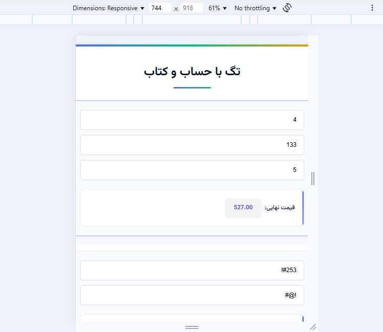

<div dir="rtl">

# تگ با حساب و کتاب - تمرین دستگرمی اول برنامه نویسی وب

<p align="center">
  
</p>

<p align="center">
  <b>دانشگاه صنعتی شریف</b><br>
  دانشکده مهندسی کامپیوتر<br>
  درس برنامه‌نویسی وب - بهار ۱۴۰۴
  <br>استاد درس: دکتر یحیی پورسلطانی
</p>

<p align="center">
  <b>علی هاشمیان</b><br>
  شماره دانشجویی: ۴۰۱۱۰۶۶۸۵
</p>

## مقدمه

این پروژه در راستای تمرین دستگرمی اول درس برنامه‌نویسی وب با عنوان "تگ با حساب و کتاب" انجام شده است. هدف از این پروژه، پیاده‌سازی یک محاسبه‌گر پویا با استفاده از JavaScript و DOM است که بتواند بر اساس ورودی‌های کاربر، محاسبات را به صورت آنی انجام دهد. این ابزار می‌تواند در طراحی فرم‌های تعاملی و داشبوردهای پویا بسیار کاربردی باشد.

## شرح مسئله

در این پروژه، هدف ایجاد یک تگ سفارشی `<formula>` است که می‌تواند عبارات ریاضی را بر اساس مقادیر ورودی‌های HTML محاسبه کند. این تگ دارای یک ویژگی `evaluator` است که فرمول محاسباتی را در خود نگه می‌دارد. با تغییر هر یک از ورودی‌ها، نتیجه محاسبه به صورت آنی به‌روزرسانی می‌شود.

مزایای این رویکرد شامل:
- کاهش نیاز به کدنویسی مجدد برای محاسبات مختلف
- افزایش تعاملی بودن فرم‌ها بدون نیاز به ارسال داده به سرور
- بهبود تجربه کاربری با نمایش نتایج به صورت آنی

## تکنولوژی های استفاده شده


## ساختار پروژه

پروژه از سه فایل اصلی تشکیل شده است:

1. **index.html**: ساختار HTML صفحه و تعریف تگ‌های `<formula>`
2. **script.js**: منطق جاوااسکریپت برای محاسبه فرمول‌ها
3. **style.css**: استایل‌دهی به صفحه و المان‌ها

## ساختار HTML
```html
<!DOCTYPE html>
<html lang="fa" dir="rtl">
<head>
    <meta charset="UTF-8">
    <meta name="viewport" content="width=device-width, initial-scale=1.0">
    <title>تمرین دستگرمی اول برنامه نویسی وب: تگ با حساب و کتاب</title>
    <link rel="stylesheet" href="style.css">
</head>
<body>
    <div class="container">
        <h1>تگ با حساب و کتاب</h1>

        <div class="formula-container">
            <div class="input-grid">
                <input type="text" id="fee" placeholder="قیمت واحد">
                <input type="text" id="count" placeholder="تعداد">
                <input type="text" id="discount" placeholder="تخفیف">
            </div>
            <div class="formula-output">
                قیمت نهایی: <formula evaluator="count*fee-discount"></formula>
            </div>
        </div>

        <div class="formula-container">
            <div class="input-grid">
                <input type="text" id="width" placeholder="عرض">
                <input type="text" id="height" placeholder="ارتفاع">
            </div>
            <div class="formula-output">
                مساحت: <formula evaluator="width*height"></formula>
            </div>
        </div>

        <div class="formula-container">
            <div class="input-grid">
                <input type="text" id="number1" placeholder="عدد اول">
                <input type="text" id="number2" placeholder="عدد دوم">
            </div>
            <div class="formula-output">
                فرمول نامعتبر: <formula evaluator="number1#number2"></formula>
            </div>
        </div>
    </div>

    <script src="script.js"></script>
</body>
</html>
```

## نحوه پیاده‌سازی

## کلاس FormulaElement

قلب این پروژه، کلاس `FormulaElement` است که برای هر تگ `<formula>` یک نمونه از آن ایجاد می‌شود. این کلاس به صورت شی‌گرا طراحی شده و مسئولیت‌های مختلفی را بر عهده دارد.

```javascript
class FormulaElement {
    static FORMULA_REGEX = /^[a-zA-Z0-9+\-*\/()\s.]+$/;

    constructor(element) {
        this.element = element;
        this.formula = element.getAttribute('evaluator');
        this.inputs = this.findInputElements();
        this.setupEventListeners();
        this.calculate();
    }

    findInputElements() {
        const operators = new Set(['+', '-', '*', '/', '(', ')']);
        const inputIds = [...new Set(this.formula.match(/([a-zA-Z0-9]+)/g) || [])]
            .filter(id => !operators.has(id));
        return inputIds.map(id => document.getElementById(id)).filter(Boolean);
    }

    setupEventListeners() {
        this.inputs.forEach(input => input.addEventListener('input', () => this.calculate()));
    }

    calculate() {
        if (!this.isValidFormula(this.formula)) {
            this.element.textContent = 'Invalid Formula';
            return;
        }

        let hasInvalidInput = false;
        const values = this.inputs.reduce((acc, input) => {
            const isValid = input.value.trim() !== '' && /^-?\d*\.?\d+$/.test(input.value);
            if (!isValid) hasInvalidInput = true;
            acc[input.id] = isValid ? parseFloat(input.value) : 0;
            return acc;
        }, {});

        if (hasInvalidInput) {
            this.element.textContent = 'Unknown';
            return;
        }

        try {
            const evalFunction = new Function(...Object.keys(values), `return ${this.formula};`);
            const result = evalFunction(...Object.values(values));
            
            this.element.textContent = 
                typeof result === 'number' && !isNaN(result) ? result.toFixed(2) : 'Invalid Formula';
        } catch (error) {
            this.element.textContent = 'Invalid Formula';
        }
    }

    isValidFormula(formula) {
        return FormulaElement.FORMULA_REGEX.test(formula);
    }
}

document.addEventListener('DOMContentLoaded', () => {
    document.querySelectorAll('[evaluator]').forEach(element => new FormulaElement(element));
});
```

کلاس `FormulaElement` دارای متدهای زیر است:

1. **constructor**: مقداردهی اولیه و راه‌اندازی محاسبه‌گر
2. **findInputElements**: شناسایی و استخراج المان‌های ورودی مرتبط با فرمول
3. **setupEventListeners**: تنظیم شنونده‌های رویداد برای ورودی‌ها
4. **calculate**: محاسبه نتیجه فرمول بر اساس مقادیر ورودی
5. **isValidFormula**: بررسی اعتبار فرمول ورودی

## روند اجرا

1. با بارگذاری کامل DOM، شنونده رویداد `DOMContentLoaded` فعال می‌شود.
2. تمام المان‌هایی که ویژگی `evaluator` دارند شناسایی می‌شوند.
3. برای هر المان، یک نمونه از کلاس `FormulaElement` ایجاد می‌شود.
4. در سازنده کلاس، ابتدا فرمول استخراج می‌شود و المان‌های ورودی مرتبط شناسایی می‌شوند.
5. برای هر المان ورودی، یک شنونده رویداد `input` تنظیم می‌شود تا با تغییر مقدار، محاسبه مجدد انجام شود.
6. محاسبه اولیه انجام می‌شود تا در صورت وجود مقادیر پیش‌فرض، نتیجه نمایش داده شود.
7. با هر تغییر در ورودی‌ها، متد `calculate` فراخوانی شده و نتیجه به‌روزرسانی می‌شود.


## ساختار کلی کلاس FormulaElement

این کلاس هنگام بارگذاری صفحه (DOMContentLoaded) برای هر عنصری که ویژگی evaluator دارد، یک نمونه جدید می‌سازد و مراحل زیر را انجام می‌دهد:


## ۱. ویژگی ثابت FORMULA_REGEX
```javascript
static FORMULA_REGEX = /^[a-zA-Z0-9+\-*\/()\s.]+$/;
```

این عبارت منظم (Regex) مشخص می‌کند چه فرمول‌هایی معتبر هستند. فقط حروف، اعداد، عملگرهای ریاضی، پرانتز، فاصله و نقطه مجاز هستند.


## ۲. سازنده کلاس constructor

```javascript
constructor(element) {
    this.element = element;
    this.formula = element.getAttribute('evaluator');
    this.inputs = this.findInputElements();
    this.setupEventListeners();
    this.calculate();
}
```
در این بخش:

- عنصر HTML ذخیره می‌شود.
- مقدار فرمول از ویژگی evaluator خوانده می‌شود.
- ورودی‌هایی که در فرمول استفاده شده‌اند، شناسایی می‌شوند.
- برای هر ورودی، یک event listener برای شنیدن تغییرات مقدار ایجاد می‌شود.
- محاسبه اولیه فرمول انجام می‌شود.


## ۳. تابع findInputElements
```javascript
findInputElements() {
    const operators = new Set(['+', '-', '*', '/', '(', ')']);
    const inputIds = [...new Set(this.formula.match(/([a-zA-Z0-9]+)/g) || [])]
        .filter(id => !operators.has(id));
    return inputIds.map(id => document.getElementById(id)).filter(Boolean);
}
```
این تابع:

- آی‌دی‌هایی که در فرمول آمده‌اند و مربوط به ورودی‌ها هستند (نه عملگرها) را استخراج می‌کند.
- از طریق document.getElementById عناصر ورودی را پیدا می‌کند و در آرایه‌ای برمی‌گرداند.


## ۴. تابع setupEventListeners
```javascript
setupEventListeners() {
    this.inputs.forEach(input => input.addEventListener('input', () => this.calculate()));
}
```
برای تمام ورودی‌ها یک رویداد input تعریف می‌شود تا هر بار که مقدار ورودی تغییر کرد، دوباره مقدار فرمول محاسبه شود.


## ۵. تابع calculate
```javascript
calculate() {
    if (!this.isValidFormula(this.formula)) {
        this.element.textContent = 'Invalid Formula';
        return;
    }

    let hasInvalidInput = false;
    const values = this.inputs.reduce((acc, input) => {
        const isValid = input.value.trim() !== '' && /^-?\d*\.?\d+$/.test(input.value);
        if (!isValid) hasInvalidInput = true;
        acc[input.id] = isValid ? parseFloat(input.value) : 0;
        return acc;
    }, {});

    if (hasInvalidInput) {
        this.element.textContent = 'Unknown';
        return;
    }

    try {
        const evalFunction = new Function(...Object.keys(values), `return ${this.formula};`);
        const result = evalFunction(...Object.values(values));
        
        this.element.textContent = 
            typeof result === 'number' && !isNaN(result) ? result.toFixed(2) : 'Invalid Formula';
    } catch (error) {
        this.element.textContent = 'Invalid Formula';
    }
}
```
در این بخش:

- ابتدا بررسی می‌شود که فرمول معتبر است یا نه.
- مقادیر ورودی‌ها بررسی و تبدیل به عدد می‌شوند.
- اگر هر ورودی نامعتبر باشد، مقدار نهایی "Unknown" نمایش داده می‌شود.
- در صورت معتبر بودن همه چیز، یک تابع با استفاده از new Function ساخته شده و فرمول اجرا می‌شود.
- نتیجه نهایی با دو رقم اعشار نمایش داده می‌شود.


## ۶. تابع isValidFormula
```javascript
isValidFormula(formula) {
    return FormulaElement.FORMULA_REGEX.test(formula);
}
```
فقط فرمول‌هایی را تأیید می‌کند که با الگوی مجاز مطابقت داشته باشند.


## ۷. مقداردهی اولیه هنگام بارگذاری صفحه
```javascript
document.addEventListener('DOMContentLoaded', () => {
    document.querySelectorAll('[evaluator]').forEach(element => new FormulaElement(element));
});
```

با بارگذاری کامل صفحه، تمام عناصری که ویژگی evaluator دارند شناسایی شده و برای هر کدام یک شیء FormulaElement ساخته می‌شود.


## نمونه استفاده

در این پروژه، سه نمونه فرمول پیاده‌سازی شده است:

۱. **محاسبه قیمت با تخفیف**: `count*fee-discount`
   ```html
   <div class="formula-container">
       <div class="input-grid">
           <input type="text" id="fee" placeholder="قیمت واحد">
           <input type="text" id="count" placeholder="تعداد">
           <input type="text" id="discount" placeholder="تخفیف">
       </div>
       <div class="formula-output">
           قیمت نهایی: <formula evaluator="count*fee-discount"></formula>
       </div>
   </div>
   ```

۲. **محاسبه مساحت**: `width*height`
   ```html
   <div class="formula-container">
       <div class="input-grid">
           <input type="text" id="width" placeholder="عرض">
           <input type="text" id="height" placeholder="ارتفاع">
       </div>
       <div class="formula-output">
           مساحت: <formula evaluator="width*height"></formula>
       </div>
   </div>
   ```

۳. **فرمول با عملگر نامعتبر**: `number1#number2`
   ```html
   <div class="formula-container">
       <div class="input-grid">
           <input type="text" id="number1" placeholder="عدد اول">
           <input type="text" id="number2" placeholder="عدد دوم">
       </div>
       <div class="formula-output">
           فرمول نامعتبر: <formula evaluator="number1#number2"></formula>
       </div>
   </div>
   ```

## اجرای برنامه و مشاهده خروجی ها

در این قسمت قصد دارم تصاویری به عنوان مثال از اجرای پروژه قرار دهم. برای اجرای پروژه کافی است فایل `index.html` را اجرا کنیم.


در تصویر زیر، یک نمای کلی از ساختار تمام صفحه مشاهده می کنید. همچنین چند تست عددی انجام شده است. همانطور که مشخص است، برای فرمول های مربوط به قیمت نهایی و مساحت، مقادیر به درستی محاسبه و نمایش داده شده اند. همچنین برای فرمول سوم که یک فرمول نامعتبر بوده (به علت وجود # در فرمول که نشان دهنده هیچ عملگر ریاضی خاصی نیست)، حتی با وجود وارد شدن مقادیر عددی نرمال، خروجی "فرمول نامعتبر" نشان داده شده است.


در این تصویر نشان داده شده است که اگر برای یک فرمول درست (و معتبر)، یکی از فیلدها خالی باشد یا مقدار یکی از فیلدها، غیرعددی باشد، خروجی "نامشخص" نشان داده می شود.


در این تصویر یک تست دیگر انجام شده است که ترکیب 3 حالت مختلف هست. همانطور که مشاهده می شود، خروجی ها همان چیزی هست که مدنظر ما بود. همچنین برای فرمول سوم (که به طور کلی غیرمعتبر هست)، عبارت "فرمول نامعتبر" نشان داده شده است.


در این تصویر نشان داده شده است که صفحه به خوبی به صورت Responsive طراحی شده است و تغییر سایز صفحه، مشکلی در نمایش صفحه ایجاد نمی کند.  



## موارد استفاده از هوش مصنوعی

در این تمرین، از ابزارهای هوش مصنوعی در بخش‌های مختلف توسعه استفاده شده است تا فرآیند طراحی و پیاده‌سازی را بهبود بخشد. در زیر به موارد استفاده، مدل‌های به کار رفته، دلایل انتخاب و تحلیل خروجی‌های هوش مصنوعی اشاره شده است:

### طراحی فایل `style.css`

برای طراحی فایل `style.css` از مدل **claude-3-7-sonnet** استفاده شده است. با توجه به اهمیت زیبایی بصری و پاسخگو بودن صفحات وب، هدف اصلی ایجاد یک ظاهر جذاب و کاربرپسند برای صفحات بوده است.

**دلیل استفاده از هوش مصنوعی:**

طراحی کامل فایل CSS به صورت دستی زمان‌بر و نیازمند دانش تخصصی در زمینه‌های مختلف طراحی وب است. استفاده از هوش مصنوعی به منظور تسریع فرآیند طراحی اولیه و ایجاد یک پایه قوی برای استایل‌دهی صفحات انجام شده است. با این حال، لازم به ذکر است که خروجی اولیه هوش مصنوعی به طور مستقیم استفاده نشده و به عنوان نقطه شروعی برای طراحی در نظر گرفته شده است.

**فرآیند توسعه و اصلاحات:**

پس از دریافت خروجی اولیه از مدل claude-3-7-sonnet، تغییرات متعددی در استایل‌ها و چینش عناصر اعمال شده است. این تغییرات بر اساس سلیقه شخصی و نیازهای خاص پروژه انجام شده و بارها با مدل هوش مصنوعی در میان گذاشته شده تا نسخه‌های اصلاح‌شده و بهتری از استایل‌ها تولید شود. این فرآیند تعاملی به دستیابی به نتیجه‌ای مطلوب و هماهنگ با اهداف پروژه کمک کرده است.

**تحلیل کد CSS:**

کد CSS نهایی، ترکیبی از خروجی هوش مصنوعی و تغییرات اعمال شده به صورت دستی است. به طور کلی، کد از ساختار مناسب و خوانایی برخوردار است و از رویکردهای مدرن CSS مانند متغیرهای CSS (`:root`) برای مدیریت رنگ‌ها و مقادیر تکرارشونده استفاده می‌کند.

**نقاط قوت ظاهری ایجاد شده توسط CSS:**

*   **ظاهر مدرن و جذاب:** استفاده از فونت زیبای Vazirmatn، گرادیان‌های ملایم در پس‌زمینه و رنگ‌های هماهنگ، ظاهری مدرن و دلنشین به صفحات بخشیده است.
*   **پاسخگویی (Responsiveness):**  به کارگیری media queries در کد CSS باعث شده است که صفحات در اندازه‌های مختلف صفحه نمایش (موبایل، تبلت، دسکتاپ) به خوبی نمایش داده شوند و تجربه کاربری مناسبی ارائه شود.
*   **جلوه‌های بصری ظریف:** انیمیشن‌های ظریف `fadeInUp` و سایه‌های ملایم (`box-shadow`) به عناصر، عمق و جذابیت بصری بیشتری افزوده است.
*   **تمرکز بر تجربه کاربری:** طراحی المان‌ها مانند دکمه‌ها و فیلدهای ورودی با در نظر گرفتن تعامل کاربر و ایجاد حس خوب در هنگام استفاده صورت گرفته است.

### بخش‌هایی از فایل `script.js`

در فایل `script.js`، بخش‌های مربوط به **مدیریت خطاها، تشخیص فرمول‌های معتبر و نامعتبر و استفاده از عبارات با قاعده (Regex)** با کمک مدل **chatgpt-4o** پیاده‌سازی شده است.

**قسمت‌های استفاده شده از هوش مصنوعی:**

```javascript
    static FORMULA_REGEX = /^[a-zA-Z0-9+\-*\/()\s.]+$/;

    isValidFormula(formula) {
        return FormulaElement.FORMULA_REGEX.test(formula);
    }

    calculate() {
        if (!this.isValidFormula(this.formula)) {
            this.element.textContent = 'Invalid Formula';
            return;
        }

        // ...

        if (hasInvalidInput) {
            this.element.textContent = 'Unknown';
            return;
        }

        try {
            // ...
        } catch (error) {
            this.element.textContent = 'Invalid Formula';
        }
    }
```

قسمت‌های مشخص شده در کد بالا، شامل تعریف عبارت با قاعده `FORMULA_REGEX` برای اعتبارسنجی فرمول‌ها، تابع `isValidFormula` که با استفاده از این عبارت با قاعده اعتبار فرمول را بررسی می‌کند و بخش‌های مربوط به مدیریت خطاها در تابع `calculate` است. این بخش‌ها به منظور اطمینان از ورود فرمول‌های معتبر و نمایش پیام‌های مناسب در صورت بروز خطا، با استفاده از chatgpt-4o توسعه داده شده‌اند.

**تحلیل نقاط ضعف و قوت کد جاوااسکریپت تولید شده توسط هوش مصنوعی:**

*   **نقاط قوت:**
    *   **اعتبارسنجی قوی فرمول:** استفاده از عبارت با قاعده `FORMULA_REGEX` به خوبی فرمول‌های ورودی را اعتبارسنجی می‌کند و از ورود فرمول‌های نامعتبر جلوگیری می‌کند.
    *   **مدیریت خطای مناسب:** کد به خوبی خطاهای مربوط به فرمول‌های نامعتبر و ورودی‌های نامعتبر را مدیریت کرده و پیام‌های informative "Invalid Formula" و "Unknown" را نمایش می‌دهد.
    *   **خوانایی و ساختار مناسب:** کد تولید شده توسط هوش مصنوعی خوانا و دارای ساختار مناسبی است و به خوبی در بخش‌های دیگر کد ادغام شده است.

*   **نقاط ضعف:**
    *   **پیام‌های خطای عمومی:** پیام‌های خطا مانند "Invalid Formula" و "Unknown" کمی کلی هستند و می‌توانستند جزئیات بیشتری را در مورد نوع خطا ارائه دهند (مثلاً "فرمول شامل کاراکترهای غیرمجاز است" یا "ورودی‌ها باید اعداد باشند"). ( *لازم به ذکر است که این مورد در راستای بهبود کد قابل اعمال است و نه لزوماً یک ضعف اساسی در کد تولید شده توسط هوش مصنوعی.* )

**سایر بخش‌های کد:**

لازم به ذکر است که سایر بخش‌های فایل `script.js`، از جمله منطق اصلی کلاس `FormulaElement` برای یافتن عناصر ورودی، تنظیم رویدادهای گوش دادن و محاسبه فرمول، به صورت دستی و بدون استفاده از هوش مصنوعی پیاده‌سازی شده‌اند.

### بخش‌هایی از گزارش نهایی تمرین (فایل `README.md`)

برای ایجاد مستند مربوط به تمرین، به ویژه در بخش‌های مربوط به ساختار ظاهری و چیدمان محتوا در فایل `README.md`، از ابزار **gemini-2.0-pro-exp** استفاده شده است.

**دلیل استفاده از هوش مصنوعی:**

هدف از استفاده از gemini-2.0-pro-exp، تسریع فرآیند ایجاد ساختار مناسب و چیدمان بصری جذاب برای فایل README.md بوده است. ایجاد یک مستند خوانا و منظم با ساختار مناسب، به درک بهتر محتوای تمرین کمک می‌کند. هوش مصنوعی در این بخش به عنوان ابزاری برای پیشنهاد ساختار و قالب‌بندی مناسب متن مورد استفاده قرار گرفته است.

**فرآیند توسعه:**

تمام متن و محتوای گزارش نهایی تمرین به صورت دستی نوشته شده است. اما برای ایجاد ساختار کلی مستند، بخش‌بندی مناسب و انتخاب سرتیترها و زیرعنوان‌ها، از پیشنهادات gemini-2.0-pro-exp بهره گرفته شده است. این ابزار به ایجاد یک ساختار منطقی و منظم برای مستند کمک کرده است.

به طور خلاصه، استفاده از ابزارهای هوش مصنوعی در این تمرین، با هدف بهبود فرآیند توسعه، تسریع طراحی و افزایش کیفیت خروجی در بخش‌های مختلف انجام شده است. تعامل با هوش مصنوعی به عنوان یک همکار و ابزار کمکی، به جای جایگزینی کامل با توسعه دستی، رویکرد اصلی در استفاده از این فناوری بوده است.


## منابع

- MDN Web Docs - [Working with objects](https://developer.mozilla.org/en-US/docs/Web/JavaScript/Guide/Working_with_Objects)
- MDN Web Docs - [Document Object Model (DOM)](https://developer.mozilla.org/en-US/docs/Web/API/Document_Object_Model)
- MDN Web Docs - [Regular expressions](https://developer.mozilla.org/en-US/docs/Web/JavaScript/Guide/Regular_Expressions)
- MDN Web Docs - [Function constructor](https://developer.mozilla.org/en-US/docs/Web/JavaScript/Reference/Global_Objects/Function/Function)

</div>
